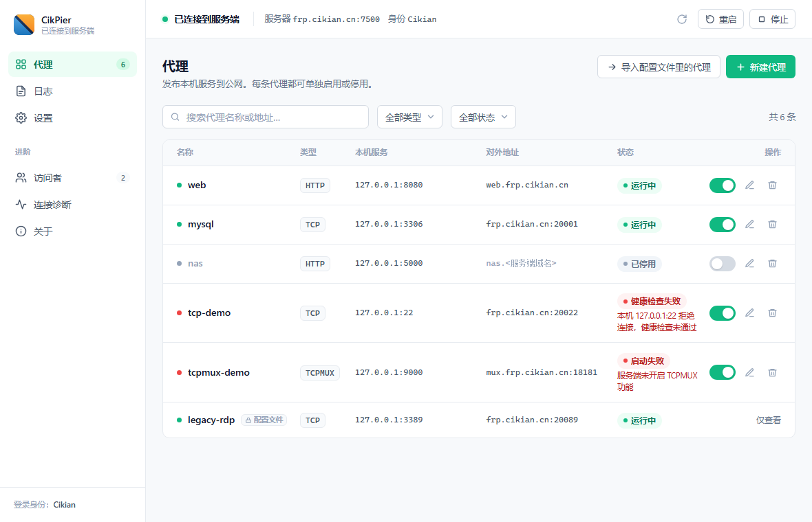
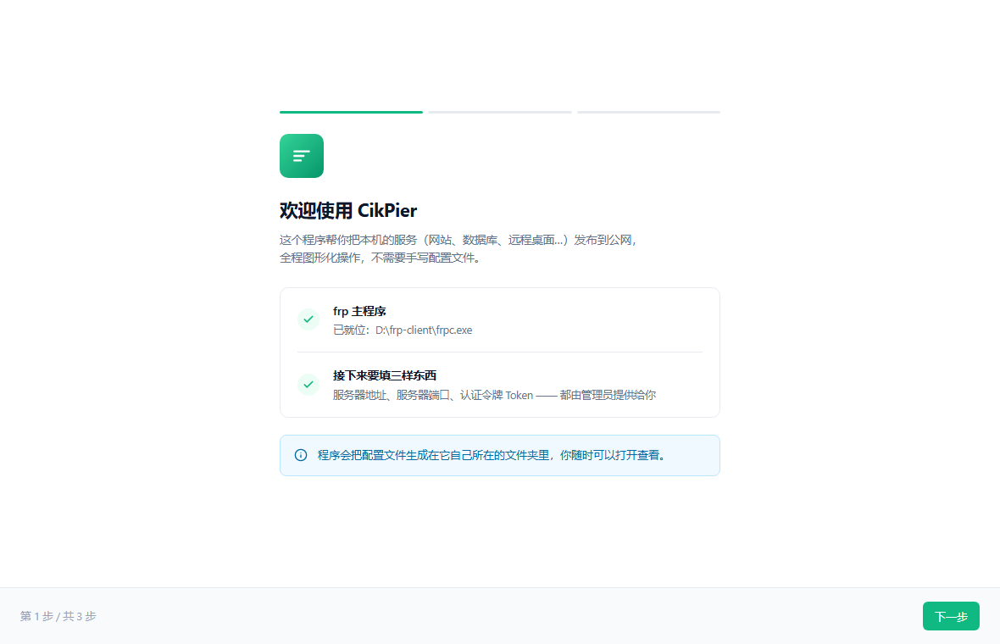
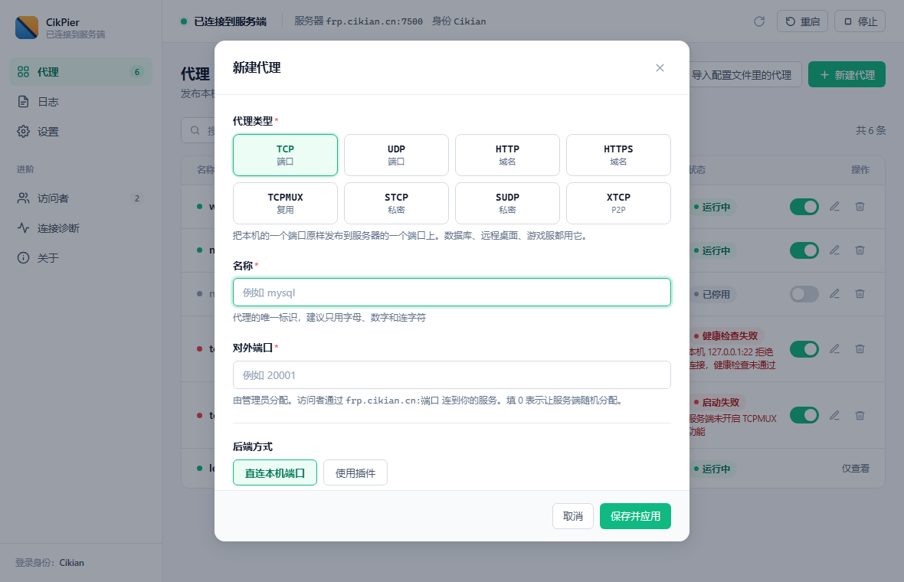

# CikPier

[中文](README.md) · **English**

**A GUI client for frp on Windows — no config files, no console windows.**

> 🪞 **Gitee mirror** (faster from mainland China): https://gitee.com/cikian/CikPier

[](LICENSE)
[](#known-limitations)
[](https://github.com/fatedier/frp)
[](https://wails.io)



> ⚠️ **The user interface is Chinese only.** The app was built for Chinese-speaking,
> non-technical Windows users. If you don't read Chinese, this project probably
> isn't for you — but the architecture notes below may still be useful.

---

## What is this

[frp](https://github.com/fatedier/frp) is excellent, but it assumes you can read
the docs and write a config file. Walking a non-technical friend through a single
`frpc.toml` over the phone takes half an hour — what a control port is, why "the
subdomain is only the leftmost label", and so on.

**CikPier reduces that to: unzip → double-click → answer three questions in a wizard.**

No terminal, no config files, no flashing console windows. Proxies are managed
individually in the UI, and when something breaks there's one-click diagnostics
that explains the problem in plain Chinese.

> **It does not modify or depend on frp's source.** It drives the stock `frpc.exe`
> from the official release — spawning the process, generating the config, reading
> its stdout, and talking to its built-in HTTP admin API.
> Upgrading frp means replacing one file; no rebuild of this app required.

## Features

| | |
|---|---|
| **Guided first-run setup** | A wizard collects server address / port / token and generates the config for you |
| **Chinese logs** | frp's English log lines are shown as Chinese summaries; click to expand the original |
| **One-click diagnostics** | Checks the binary, the config, the process, the server connection, **and whether each proxy's local port is actually accepting connections** |
| **Per-proxy enable/disable** | Toggle a single proxy without stopping frp entirely |
| **Works without an auth token** | If your server sets no `auth.token`, leave the field empty — the app won't block you |
| **Warns on architecture mismatch** | Running the x64 build on ARM shows a notice (WebView2 has a known crash bug in that combination) |
| **Tray icon & autostart** | Tray icon is colour-coded by connection state; autostart uses HKCU, **no admin rights needed** |
| **Eight proxy types** | TCP / UDP / HTTP / HTTPS / TCPMUX / STCP / SUDP / XTCP, plus visitors |
| **Local port pre-check** | Warns when nothing is listening on the local port you typed |

## Download

**Requirements:** Windows 10 / 11. Windows 11 ships with WebView2; on Windows 10
you may need to [install it](https://developer.microsoft.com/microsoft-edge/webview2/).

Grab the build matching your CPU from [Releases](https://github.com/Cikian/CikPier/releases/latest):

| Your machine | Download |
|---|---|
| Regular PC (Intel / AMD) | `CikPier-v1.0.0-amd64.zip` |
| Windows on ARM (Snapdragon, Surface Pro X) | `CikPier-v1.0.0-arm64.zip` |

Not sure which? **Settings → System → About**, look at "System type".

> 🪞 **Can't reach GitHub?** The same two archives are on Gitee:
> https://gitee.com/cikian/CikPier/releases

Then:

1. **Unzip anywhere** — avoid `C:\Program Files\`, which triggers admin prompts
2. **Double-click `CikPier.exe`**
3. Fill in **server address / port / auth token** (get these from whoever runs your frps)

When the top bar turns 🟢 **已连接到服务端** (connected), you're done.

> The archive contains exactly four files: `CikPier.exe`, `frpc.exe`, `使用说明.md`
> (user manual, Chinese), and `LICENSE`.

## Screenshots

The first-run wizard — three steps and you're up:



Creating a proxy — pick a type, set the local port; advanced options stay collapsed:



## Relationship to frp

CikPier is a **third-party client** in the frp ecosystem and is not affiliated
with the frp project.

- It does **not modify or fork** frp. It drives the official `frpc.exe` as a
  subprocess (spawn, generate config, read stdout, call frp's HTTP admin API)
- Upgrading frp therefore means replacing `frpc.exe` and nothing else
- Connection state is **inferred from frpc's log output**, because frp's admin API
  does not expose "am I connected to the server". This is why the app insists on
  `log.to = console`

## Known limitations

Being upfront so you don't waste your time:

- **Windows only.** No macOS or Linux build
- **The arm64 build has never been run on real hardware** — I don't own an ARM
  device. All I verified is that the compiled artifact has the correct PE machine
  type and the icon embeds properly. Testing on an actual ARM machine would be
  very welcome
- **The UI is Chinese only**
- **No installer yet** (portable zip), no traffic statistics, no dark mode

## Building from source

You need **Go 1.25+** and the **Wails CLI**.
**No Node.js / npm required** — the frontend is three static files with no build step.

```powershell
git clone https://github.com/Cikian/CikPier.git
cd CikPier/app
wails dev          # hot reload while editing
go test ./...      # unit tests
```

Package both architectures in one run:

```powershell
cd CikPier
powershell -ExecutionPolicy Bypass -File tools/package.ps1 -Version 1.0.0
```

> Packaging needs the official `frpc.exe`, which is **not** in this repo
> (it's over 100 MB and doesn't belong in git). Download it from
> [frp Releases](https://github.com/fatedier/frp/releases) and put it in
> `frp-bins/win-amd64/` (or `win-arm64/`), or pass `-FrpcPath`.
> The arm64 binary is downloaded automatically if missing.

> 📖 **The development documentation is currently Chinese only** —
> see [`docs/`](docs/README.md). It covers setup, a full code map, how to modify
> things, packaging/releasing, and testing/troubleshooting.

## License

[Apache License 2.0](LICENSE). Use it, change it, ship it.

The bundled `frpc.exe` comes from [fatedier/frp](https://github.com/fatedier/frp)
and is likewise Apache-2.0 licensed.

---

<sub>[中文说明](README.md) · [English](README.en.md)</sub>
